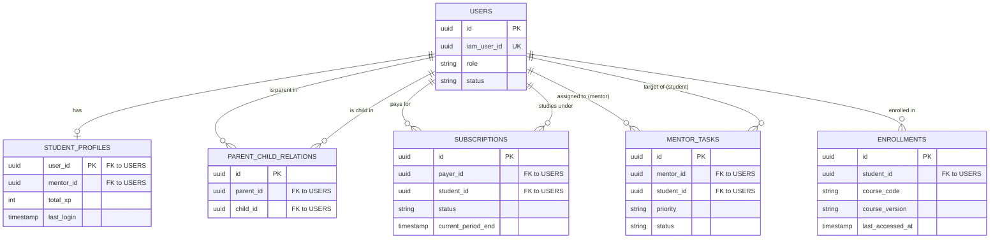

Вот обновленная версия документа «ENTITY-RELATIONSHIP DIAGRAM (ERD) & DATA MODEL» с учетом интеграции подхода **Content-as-Code (Git)**, хранения медиа в **Google Cloud Storage (GCS)** и механизма **Version Pinning** (фиксации версий для студентов).

Имя файла для сохранения: `06_Mindwave_ERD_Data_Model_v2.md`

⸻

# ENTITY-RELATIONSHIP DIAGRAM (ERD) & DATA MODEL
**Продукт:** Платформа Mindwave (Гибридная образовательная экосистема)
**СУБД/Хранилища:** PostgreSQL (Бизнес-ядро), MongoDB (Версионированный контент), Redis (Кэш), Google Cloud Storage (Медиа), Git (Исходники контента)
**Статус:** Утверждено

---

## 1. Стратегия хранения данных с учетом Keycloak и Git

1. **Авторизация:** За логины и пароли отвечает **Keycloak**. Наша локальная база данных (PostgreSQL) хранит только `iam_user_id` и бизнес-профили.
2. **Контент как код:** Структура курсов хранится в **Git-репозиториях**, а тяжелые медиафайлы (видео, PDF) — в **Google Cloud Storage (GCS)**. При слиянии веток CI/CD пайплайн собирает релиз курса и записывает его в **MongoDB** в виде неизменяемой версии.

---

## 2. Реляционная модель (PostgreSQL) — Ядро бизнес-логики

Ниже описана структура основных таблиц для сервисов User Management, Billing и CRM.

### 2.1. Таблицы пользователей и связей (Users & Hierarchy)

* **`users` (Базовый профиль)**
    * `id` (UUID, PK) — внутренний ID системы.
    * `iam_user_id` (UUID, Unique) — ID из Keycloak (Sub).
    * `role` (Enum) — `ADULT`, `CHILD`, `PARENT`, `MENTOR`, `ADMIN`.
    * `email` (String) — для уведомлений (Airflow).
    * `first_name`, `last_name` (String).
    * `status` (Enum) — `ACTIVE`, `SUSPENDED` (если не оплатил).

* **`student_profiles` (Специфичные данные студента)**
    * `user_id` (UUID, PK, FK -> `users.id`).
    * `mentor_id` (UUID, FK -> `users.id`) — привязанный ментор.
    * `total_xp` (Int) — геймификация.
    * `current_streak` (Int) — текущее количество дней подряд.
    * `timezone` (String) — важно для рассылки пушей и Airflow.

* **`parent_child_relations` (Таблица-связка)**
    * `id` (UUID, PK).
    * `parent_id` (UUID, FK -> `users.id`, роль = PARENT).
    * `child_id` (UUID, FK -> `users.id`, роль = CHILD).

### 2.2. Коммерческий контур (Subscriptions)

* **`subscriptions` (Подписки)**
    * `id` (UUID, PK).
    * `payer_id` (UUID, FK -> `users.id`).
    * `student_id` (UUID, FK -> `users.id`).
    * `plan_id` (String) — идентификатор тарифа.
    * `status` (Enum) — `ACTIVE`, `PAST_DUE`, `CANCELED`.
    * `current_period_end` (Timestamp).

### 2.3. Операционный контур (CRM Tasks)

* **`mentor_tasks` (Очередь задач для ментора)**
    * `id` (UUID, PK).
    * `mentor_id` (UUID, FK -> `users.id`).
    * `student_id` (UUID, FK -> `users.id`).
    * `trigger_type` (String).
    * `priority` (Enum) — `LOW`, `MEDIUM`, `HIGH`, `CRITICAL`.
    * `status` (Enum) — `OPEN`, `IN_PROGRESS`, `RESOLVED`.
    * `created_at`, `resolved_at` (Timestamp).

### 2.4. Академический прогресс и Version Pinning (Enrollments)

* **`enrollments` (Записи на курс)**
    * `id` (UUID, PK).
    * `student_id` (UUID, FK -> `users.id`).
    * `course_code` (String) — базовый код курса (например, "math_5").
    * **`course_version` (String) — зафиксированная версия (например, "v1.0.0"). Гарантирует, что студент не столкнется с деградацией курса без явного апгрейда.**
    * `progress_percent` (Float).
    * `last_accessed_at` (Timestamp).

---

## 3. Визуализация реляционной схемы (Mermaid.js)



---

## 4. Документоориентированная модель (MongoDB) — Версионированное контентное ядро

Сложную иерархию курсов мы берем из Git и кладем в MongoDB. Каждый релиз курса сохраняется как **отдельный независимый документ**. Файлы медиа ссылаются напрямую на бакеты Google Cloud Storage.

**Коллекция `Courses` (Пример хранения двух версий одного курса):**

```json
[
  {
    "_id": "course_math_5_v1_0_0",
    "course_code": "math_5",
    "version": "v1.0.0",
    "status": "ARCHIVED", 
    "title": "Математика 5 класс",
    "modules": [
      {
        "module_id": "mod_1",
        "title": "Дроби",
        "lessons": [
          {
            "lesson_id": "les_1_1",
            "content_type": "VIDEO",
            "video_url": "https://storage.googleapis.com/mindwave-content-prod/math_5/media/fractions_v1.mp4"
          }
        ]
      }
    ]
  },
  {
    "_id": "course_math_5_v2_0_0",
    "course_code": "math_5",
    "version": "v2.0.0",
    "status": "PUBLISHED", 
    "title": "Математика 5 класс (Обновленная программа)",
    "modules": [
      {
        "module_id": "mod_1",
        "title": "Дроби и проценты",
        "lessons": [
          {
            "lesson_id": "les_1_1",
            "content_type": "VIDEO",
            "video_url": "https://storage.googleapis.com/mindwave-content-prod/math_5/media/fractions_v2.mp4"
          }
        ]
      }
    ]
  }
]
```
*Почему так:* Фронтенд запрашивает курс у Node.js сервиса, передавая `course_code` и `course_version` (из таблицы `enrollments`). Бэкенд достает из MongoDB ровно ту версию, к которой привык студент, с гарантированно работающими ссылками на GCS.

---

## 5. Как это решает бизнес-задачи

1.  **Защита траектории (Version Pinning):** Благодаря полю `course_version` в таблице `enrollments`, методисты могут свободно пушить обновления в Git и создавать `v2.0.0`. Студент, который начал учиться месяц назад, останется на `v1.0.0` и не потеряет свой прогресс или сданные тесты, пока сам не нажмет кнопку «Обновить курс».
2.  **Экономия на хранении и доставке:** Мы не перегружаем нашу базу тяжелыми медиа. MongoDB хранит только легковесные JSON, а Google Cloud CDN быстро раздает видеоконтент по всему миру напрямую из GCS.
3.  **Разделение режимов (Adult vs Child):** У Adult-пользователя `role = ADULT`. Он сам себе `payer_id` и `student_id` в таблице `subscriptions`. У него нет записей в `parent_child_relations`. Система автоматически изолирует его.
4.  **Эффективность Ментора и Airflow:** Чтобы Airflow нашел тех, кто рискует отвалиться, он делает элементарный запрос в PostgreSQL: `SELECT student_id FROM enrollments WHERE last_accessed_at < NOW() - INTERVAL '3 days'`. Менторские задачи также извлекаются простейшим `SELECT` запросом за миллисекунды.